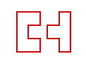

## 块级元素
如果一个元素里只有浮动元素，那它的高度会是0。如果你想要它自适应即包含所有浮动元素，那你需要清除它的子元素。
一种方法叫做clearfix，即clear一个不浮动的 ::after 伪元素。
```css
#container::after {
  content: "";
  display: block;
  clear: both;
}
```
或者使用BFC 也可以

## width/height 的具体作用

#### width:auto
width属性的默认值，但是至少包含一下四种不同宽度表现
1. 充分利用空间，eg. div p元素默认宽度100%于父元素容器
2. 收缩与包裹，典型代表浮动、绝对定位、inline-block元素或者table元素
3. 收缩到最小，最容易出现在table-layout(于布局表格单元格，行和列的算法)为auto的表格中，
4. 超出容器限制，除非有明确的wiidth相关设置，不然上面的三情况均不会超过父类宽度，white-space: nowarp

## 外部尺寸和流体结构
1. 正常流宽度
表选为“外部尺寸”的块级元素一旦设置宽度，流动性消失了。
流动性并不是看上去设置的宽度100%那么简单，是margin/border/padding/content 内容区域自动分配水平空间的机制。
设置windth 100% 时，当元素存在margin/border/padding时，宽度会超出外部的容器，流动性丢失。`设置windth （iE除外）就是针对coontent的内容，当为100%时 整体margin+border+padding 超出外部容器`
`无宽度： 少了计算(真实的宽度要100% 减去margin+border+padding)，少了维护`
2. 格式化宽度(同样具有完全的流动性)
仅出现在position为absolute/fixed的元素中。默认情况下绝对定位元素的宽度表现包裹性，宽度由内部尺寸决定。但也有特殊情况由外部尺寸决定：当对立方位属性一起出现top/bottom，left/right时元素宽度的大小相当于最近的具有定位特性的祖先元素计算而来（最近定位祖先元素宽度-left-right）

## 内部尺寸和流动性
判断“内部尺寸”：假如元素内部没内容，宽度就是0
1. 包裹性(包裹 + 自适应性：元素尺寸由内部元素决定，永远小于包含块的尺寸)
按钮就是最好的例子， 按钮的最大宽度是容器的240px
```css
/* 某个模块中文字是动态的，文字少居中，多的时候居左显示 */
/* box外部设置一个div 设置宽度就不要box再去设置宽度，保持流动性 */
.box {
  padding: 10px;
  background-color: #cd0000;
  text-align: center;
}
.box > .content {
  display: inline-block;
  text-align: left;
}
```
2. 首选最小宽度
元素适合的最小宽度
CSS世界中图片和文字的权重远大于布局，CSS设计者不会在waidth：auto时设置图文的宽度为0,具体表现如下‘
  1. 东亚文字最小宽度是每个文字的宽度：文字会一列展示下去
  2. 西方由特定的连续的英文字符单元决定（一般终止与普通空格，短横线，问号，以及其他非英文字符等）：display:inline-和block两部分，word-break:break-all 就和中文一样了
  ```html
  <style>
  .ao,
  .tu {
    display: inline-block;
    width: 0;
    font-size: 14px;
    line-height: 18px;
    margin: 35px;
    color: #fff;
  }
  .ao:before,
  .tu:before {
    outline: 2px solid #cd0000;
    font-family: Consolas, Monaco, monospace;
  }
  .ao:before {
    content: "love你love";
  }
  .tu {
    direction: rtl;
  }
  .tu:before {
    content: "我love你";
  }
  </style>
  <span class="ao"></span>
  <span class="tu"></span>
  ```
  

3. 最大宽度
设置white-space: nowrap声明后的宽度。
box-sizing: content-box(默认)/margin-box(现实不支持)/border-box/padding-box

“margin的背景永远是透明的”，因此不可能作为background-clip或background-origin属性出现。

设置宽度width的时候，流动性消失，元素不会如流水一样的充满整个容器空间

`CSS流体布局下的宽度分离原则，width属性不和影响宽度的padding/border 属性共存`

## height
父元素height: auto 时，只要子元素在文档流中，其百分比完全被忽略。
完全百分比的时候需要在html元素开始每一层都需要使用百分比来显示。

绝对定位的宽高百分比计算是相对于padding box,非绝对定位元素相对于content box计算

## min/max-width/hight
max-width 设置时 height: auto 必须的，不然会压缩图
max-width会覆盖width, !important都靠边站


max-height:0 到一个固定的max-height 就可以实现展开动画效果

## 内联元素
button 默认的display是inline-block
img 默认是是display是inline
