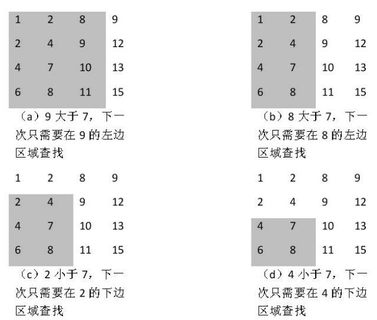

## 分析

二维数组是从左到右，从上到下的顺序排列的。




## 代码

```js
var findNumber = function(nums, num) {
  let row = 0
  let rows = nums.length-1
  if(rows === 0) return -1
  let column = nums[0].length-1
  while(row < rows && column >= 0){
    if(nums[row][column] > num){
      --column
    } else if(nums[row][column] < num){
      ++row
    } else {
      return [row, column]
    }
  }
  return -1
}
```