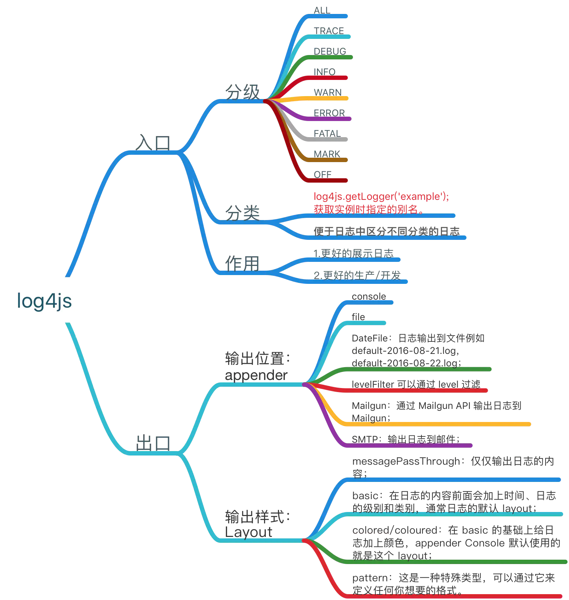
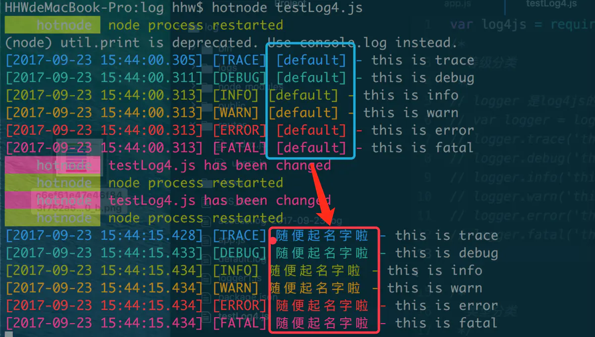

## log4js-node
```shell
npm install log4js
```



```js
var logger = log4js.getLogger('随便起名字啦');
logger.trace('this is trace');
logger.debug('this is debug');
logger.info('this is info');
logger.warn('this is warn');
logger.error('this is error');
logger.fatal('this is fatal');
```


[Nodejs log4js日志管理详解](https://www.jianshu.com/p/9604d08db899)

